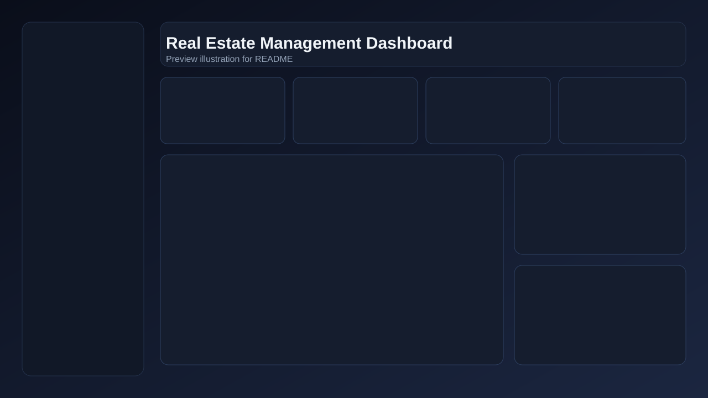
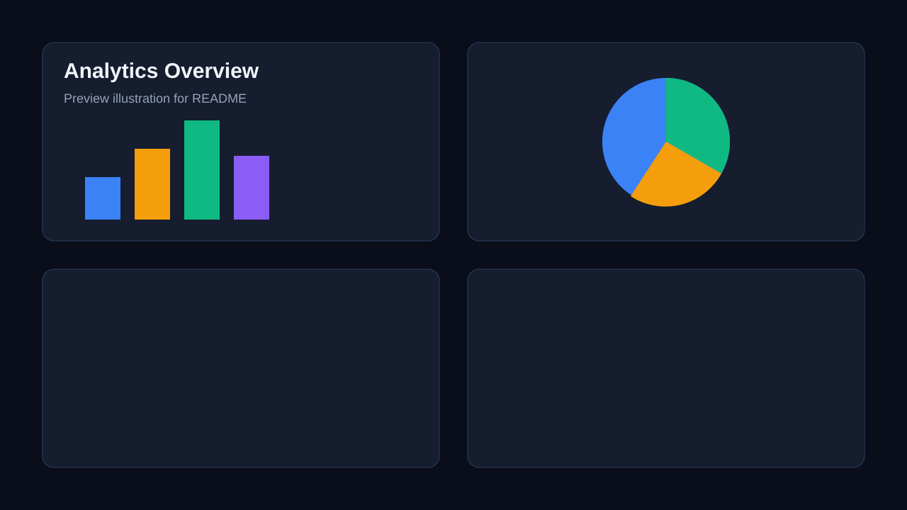
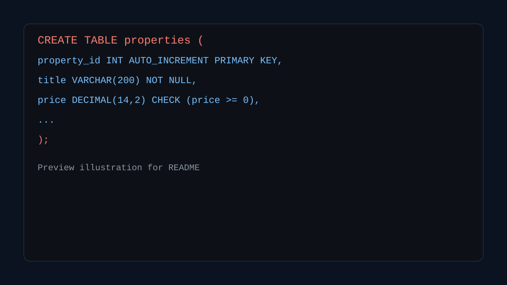

# Real Estate Management Database System

A full-stack style mini project that demonstrates a **Real Estate DBMS** workflow with:
- interactive frontend dashboard (HTML, CSS, JavaScript)
- normalized MySQL schema and seed scripts
- analytical SQL queries and ACID transaction example

## Project Preview

### Dashboard


### Analytics


### SQL Module


## Features

- Multi-page dashboard UI with sidebar navigation
- In-memory CRUD simulation for:
  - users
  - agents
  - owners
  - locations
  - properties
  - bookings
  - payments
  - reviews
- Booking lifecycle and status updates
- Revenue and booking analytics visualization
- SQL reference panel inside frontend
- Dedicated SQL scripts for schema, data, and reporting

## Tech Stack

- Frontend: HTML5, CSS3, Vanilla JavaScript
- Database: MySQL 8+ (scripts included)
- Version Control: Git + GitHub

## Project Structure

```text
.
├── css/
│   └── styles.css
├── js/
│   └── app.js
├── sql/
│   ├── 01_schema.sql
│   ├── 02_seed_data.sql
│   ├── 03_query_full_listing.sql
│   ├── 04_query_revenue_by_type.sql
│   ├── 05_query_top_agents_and_ratings.sql
│   └── 06_transaction_acid_booking.sql
├── docs/
│   └── images/
│       ├── dashboard-preview.svg
│       ├── analytics-preview.svg
│       └── sql-preview.svg
├── index.html
└── README.md
```

## Run Frontend Locally

1. Open project root.
2. Start local server:

```bash
python -m http.server 5500
```

3. Open:

```text
http://localhost:5500/index.html
```

## Run SQL Files (MySQL)

Execute scripts in this order:

1. `sql/01_schema.sql`
2. `sql/02_seed_data.sql`
3. `sql/03_query_full_listing.sql`
4. `sql/04_query_revenue_by_type.sql`
5. `sql/05_query_top_agents_and_ratings.sql`
6. `sql/06_transaction_acid_booking.sql`

Example:

```bash
mysql -u root -p < sql/01_schema.sql
mysql -u root -p < sql/02_seed_data.sql
```

## Notes

- Frontend currently uses an in-memory dataset for live interaction.
- SQL scripts are production-style references and can run independently in MySQL.
- To connect UI directly with MySQL, add a backend API layer (Node/Express or Flask).

## Author

Aryan Raj Pandey

GitHub: https://github.com/Aryanrajpandey
